# MySQL ERD 생성

### ✨MySQL ERD 생성

- ERD를 생성할 DB에 접속(커넥션)

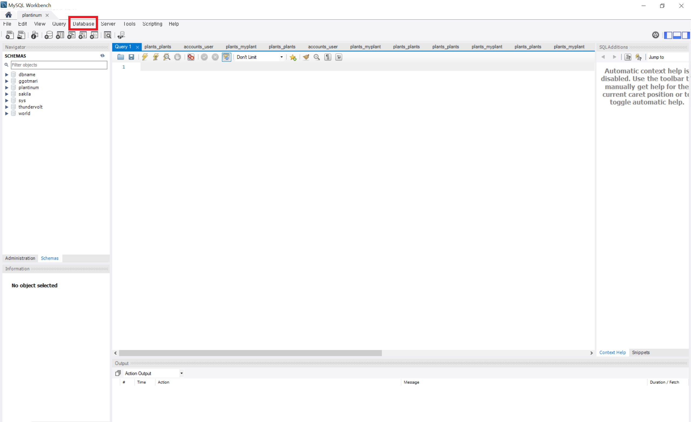

- `Ctrl + R` 또는 워크벤치 상단의 메뉴 `Database - Reverse Engineer Database` 클릭

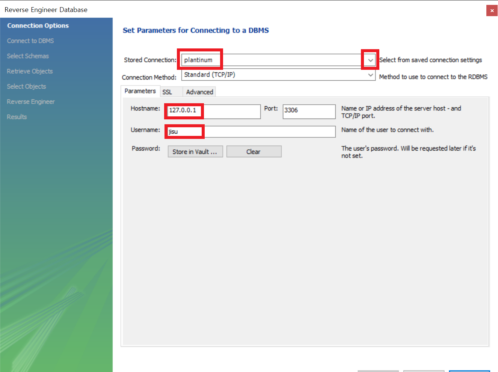

- ERD를 생성할 커넥션 선택
  - `Stored Connection` 오른쪽 화살표를 누르면 연결된 커넥션 목록에서 선택 가능
- `Next` 클릭

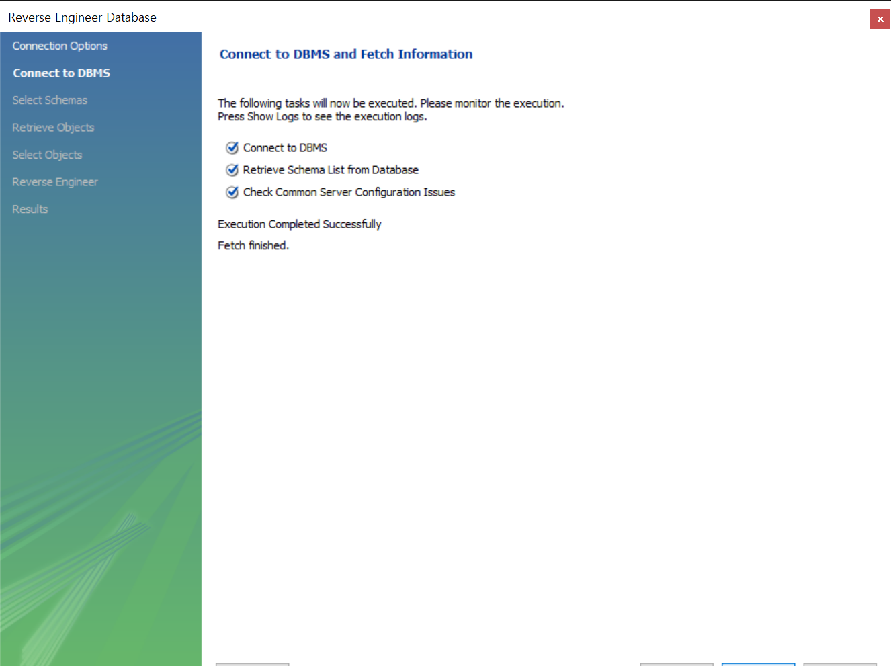

- `Next` 클릭

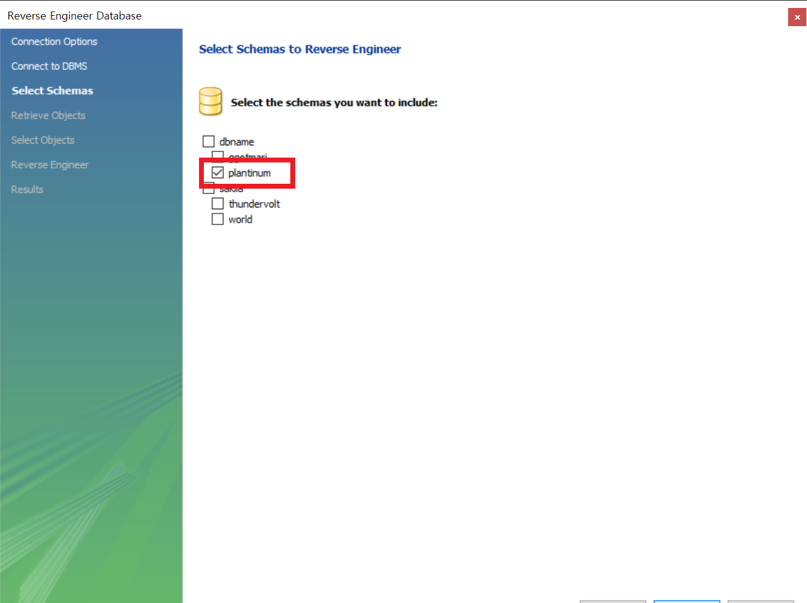

- 스키마 선택
- `Next` 클릭

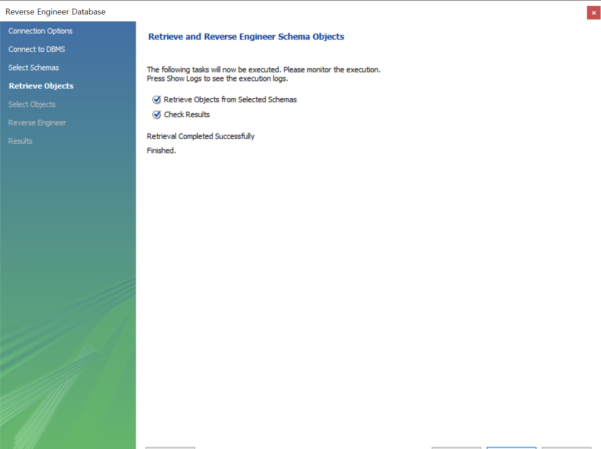

- `Next` 클릭

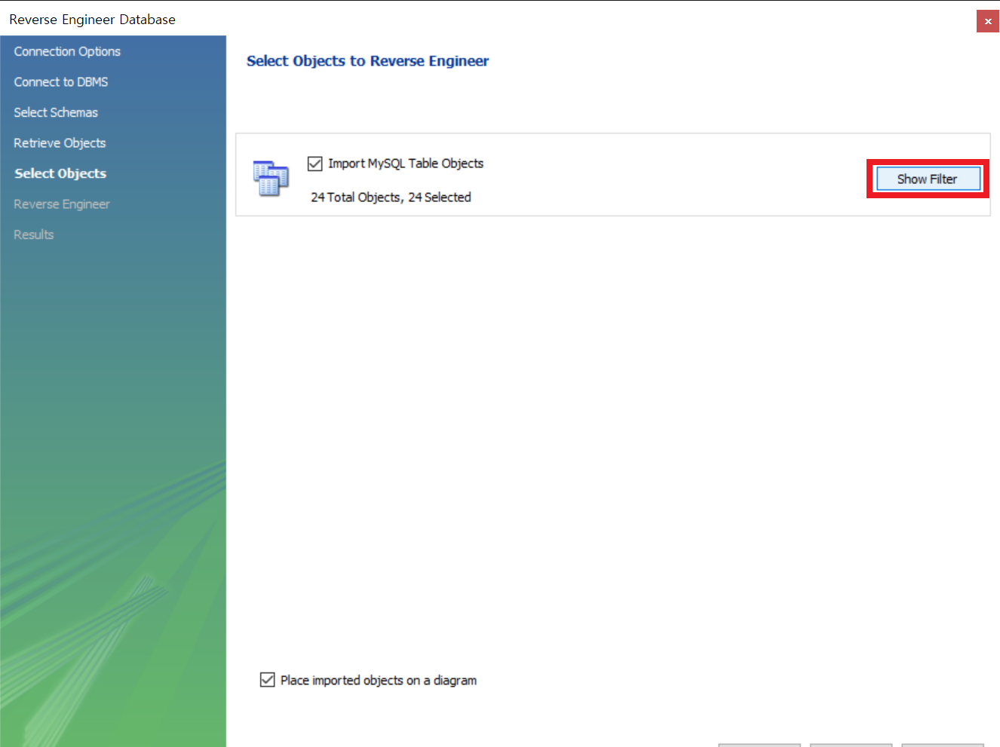

- 어떤 테이블을 포함할 것인지 선택
  - `Show Filter`를 클릭하면 테이블 목록 선택 가능

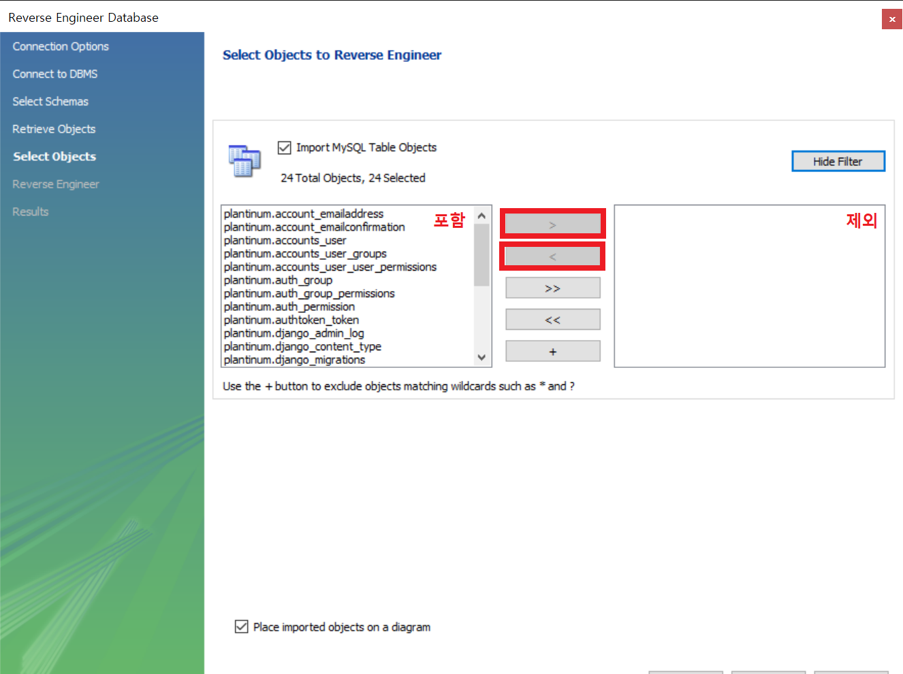

- 왼쪽은 포함할 테이블, 오른쪽은 제외할 테이블

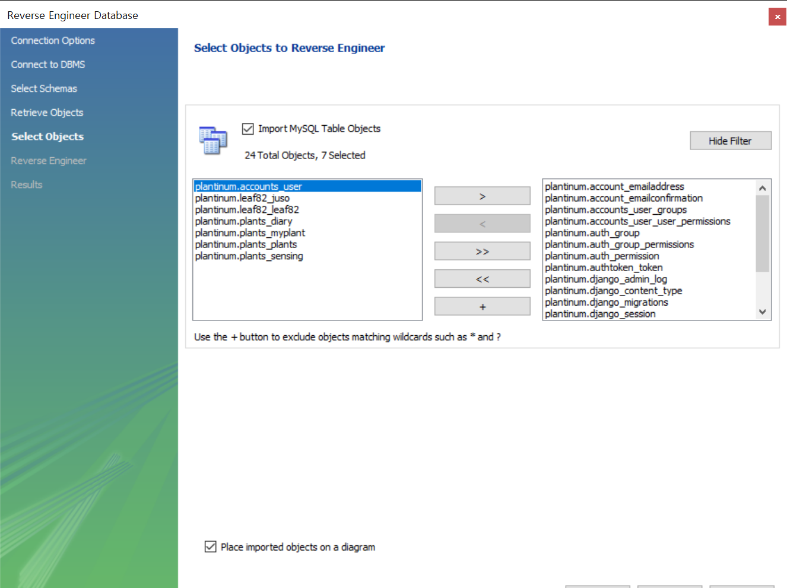

- `Execute` 클릭

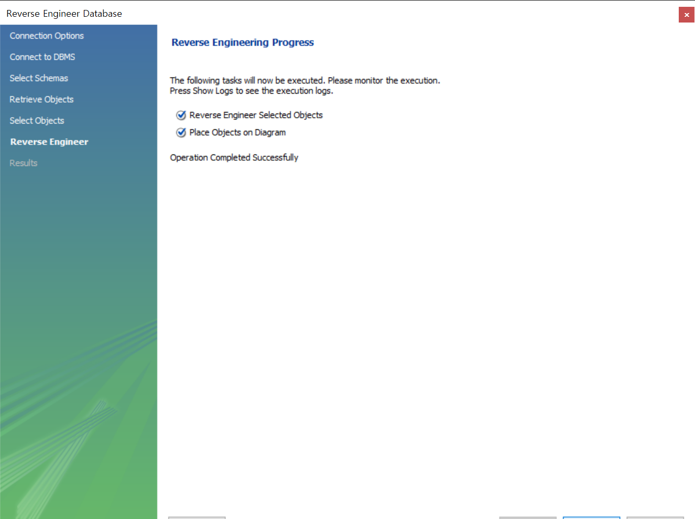

- `Next` 클릭

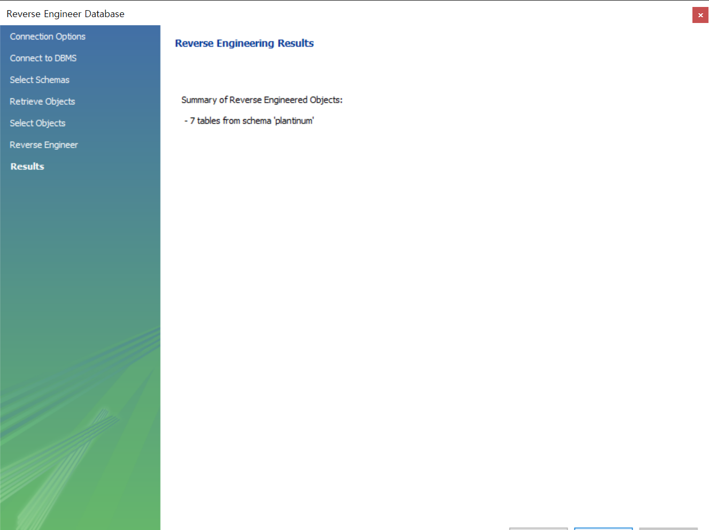

- 실행 결과 확인, `Finish` 클릭

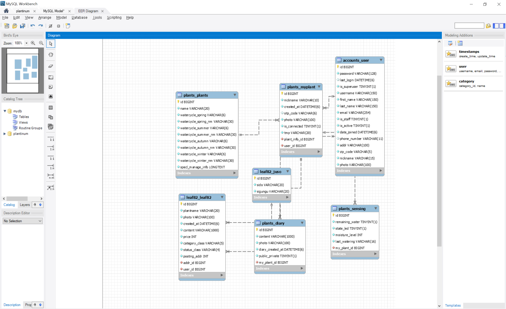

- ERD 생성 화면

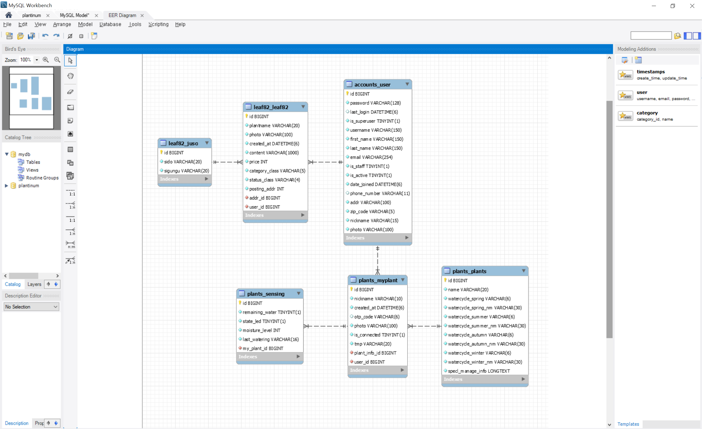

- 정렬하기
- 워크벤치 상단의 메뉴 `File - Export - Export as PNG` 등을 통해 이미지 저장