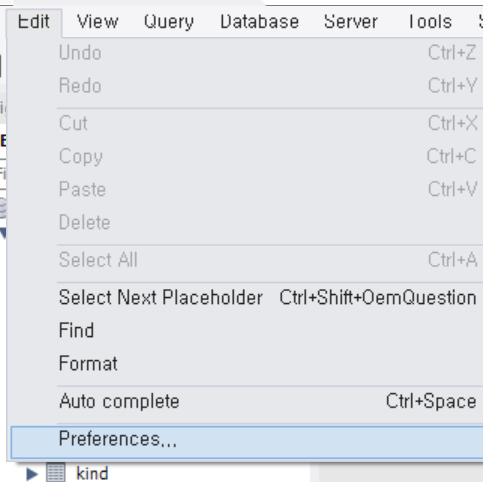
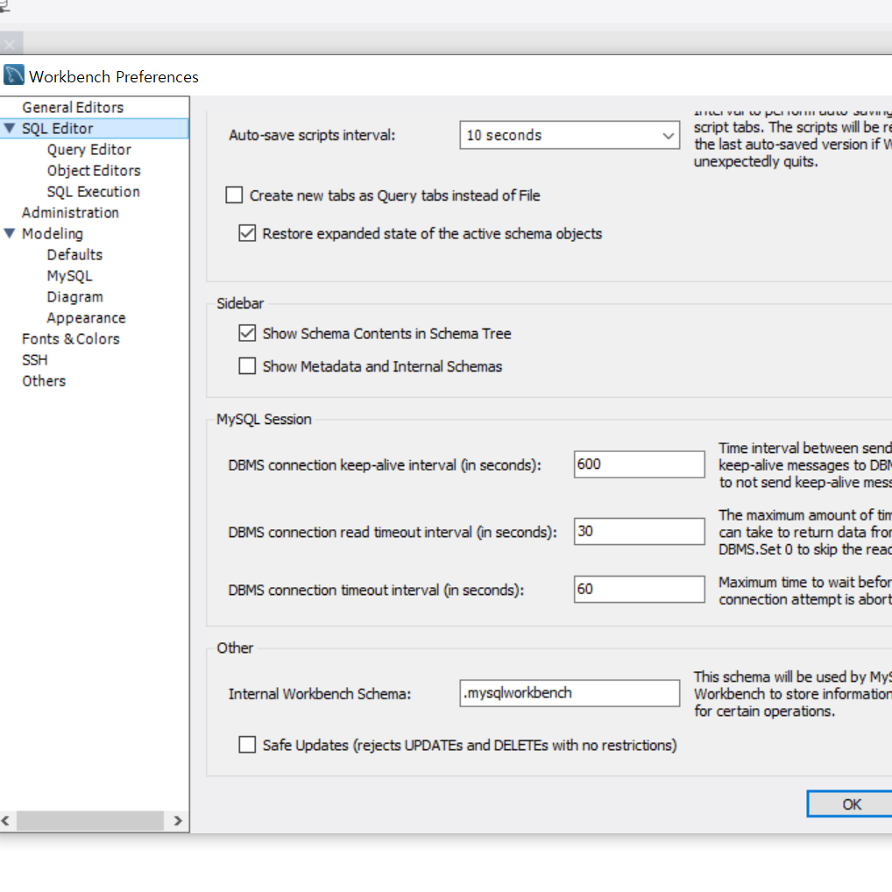

# 📌MySQL 오류 및 해결

---------------

[TOC]


### ✨error code: 1175. you are using safe update mode

- 다수의 데이터를 키값을 사용하지 않고 삭제 또는 수정하려고 시도했을 때 발생

- 오류 내용

  ```
  error code: 1175. you are using safe update mode and you tried to update a table without a where that uses a key column. to disable safe mode, toggle the option in preferences -> sql editor and reconnect.
  ```

- 해결 방법 1

  ```sql
  set sql_safe_updates=0;
  ...
  set sql_safe_updates=1;
  ```

  - 일시적 safe mode 해제
  - 쿼리 실행 후 다시 safe mode 설정

- 해결 방법 2

  - `Edit > Preferences` 선택
  - `SQL Editor > Safe Updates` 체크박스 해제, `OK` 
  - 워크벤치 재시작 필요




`Edit > Preferences` 선택



`SQL Editor > Safe Updates` 체크박스 해제, `OK` 

