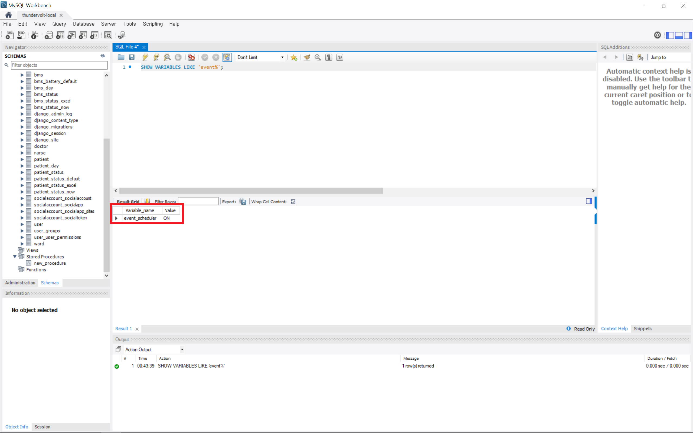
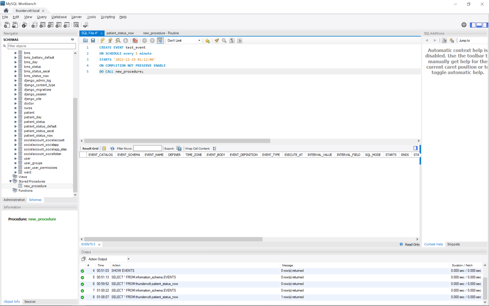
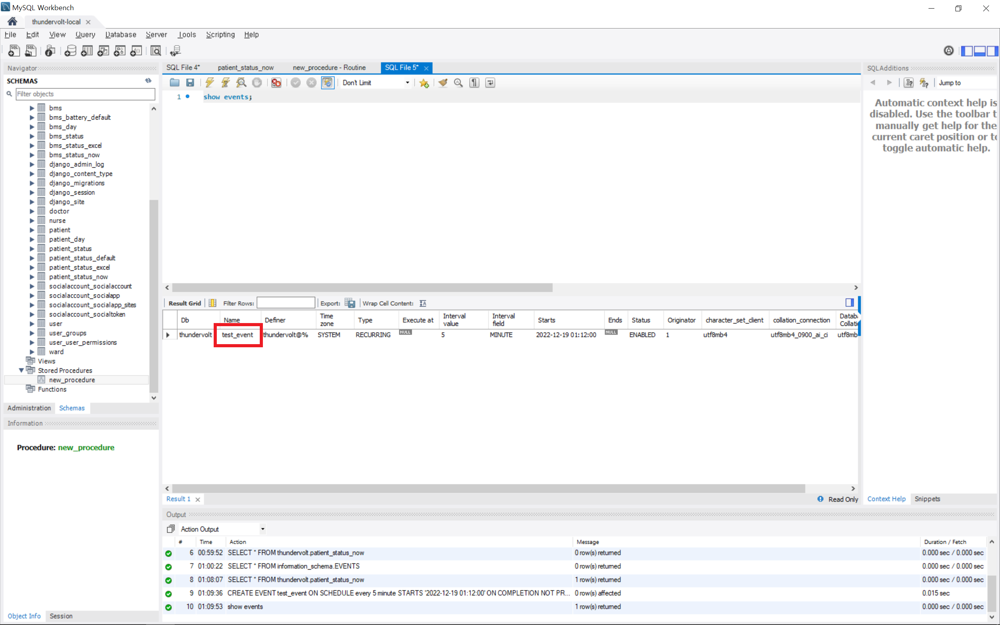
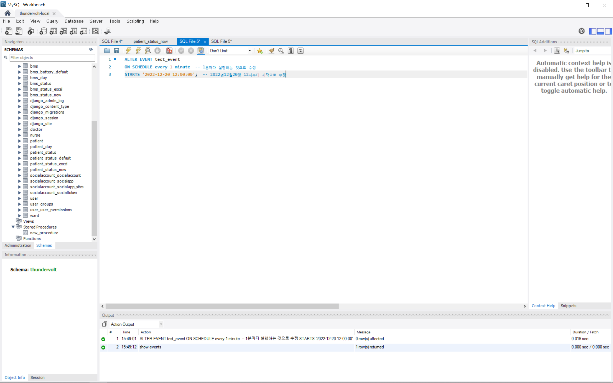
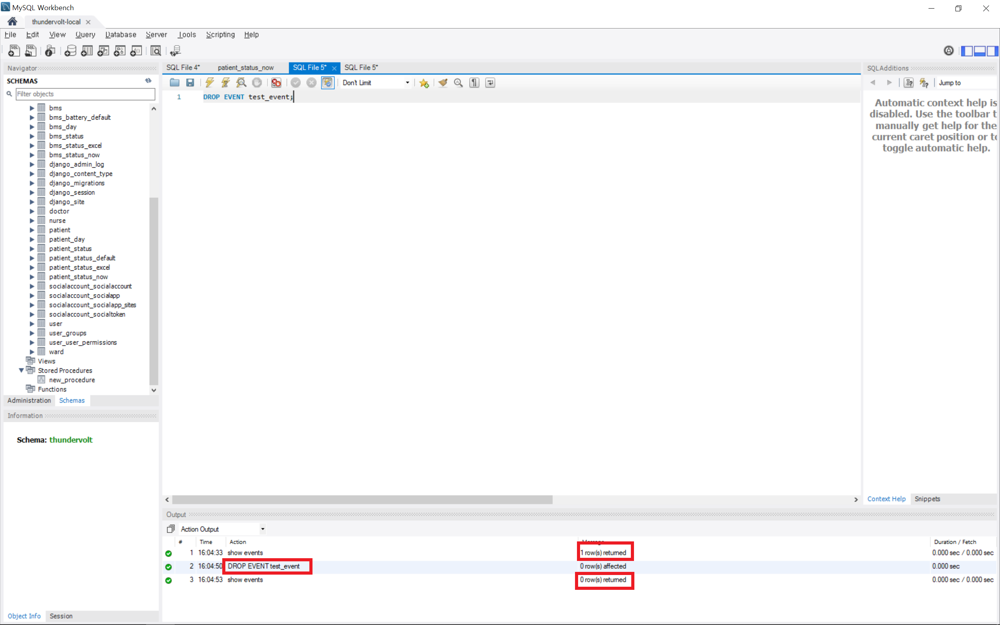

# MySQL 이벤트 스케줄러(event scheduler) 


### 목차

1. [이벤트 스케줄러 활성화](#이벤트-스케줄러-활성화)
2. [이벤트 스케줄러 생성](#이벤트-스케줄러-생성)
3. [이벤트 스케줄러 확인](#이벤트-스케줄러-확인)
4. [이벤트 스케줄러 수정](#이벤트-스케줄러-수정)
5. [이벤트 스케줄러 삭제](#이벤트-스케줄러-삭제)


### 이벤트 스케줄러 활성화



- 이벤트 스케줄러 상태 확인

  ```sql
  SHOW VARIABLES LIKE 'event%';
  ```

- 이벤트 스케줄러 활성화 (OFF인 경우)

  ```sql
  SET GLOBAL event_scheduler = ON;
  ```


### 이벤트 스케줄러 생성



- 이벤트 스케줄러 생성

  [공식문서](https://dev.mysql.com/doc/refman/8.0/en/create-event.html)
  
  ```sql
  CREATE EVENT 이벤트 이름
  ON SCHEDULE 이벤트 실행(반복) 시간
  STARTS 시작 시간
  ENDS 종료 시간  -- 생략가능(수동 종료 전까지 실행), 해당 종료 시간까지 포함하여 실행
  ON COMPLETION NOT PRESERVE  -- 이벤트 종료 시 완료 후 이벤트 삭제
  -- ON COMPLETION PRESERVE  이벤트 종료 시 완료 후 이벤트를 삭제하지 않음(DISABLE 상태로 변환)
  ENABLE  -- 활성화 상태로 생성(기본설정), DISABLE을 통해 비활성화된 상태로 생성 가능
  DO 실행할 명령문;
  ```
  
- 예시

  ```sql
  CREATE EVENT test_event
  ON SCHEDULE every 5 minute
  STARTS '2022-12-19 01:12:00'
  ON COMPLETION NOT PRESERVE
  ENABLE
  DO CALL new_procedure;
  ```


### 이벤트 스케줄러 확인



- 이벤트 스케줄러 전체 확인

  ```sql
  SELECT * FROM information_schema.EVENTS;

- 선택된 DB의 이벤트 스케줄러 확인

  ```sql
  SHOW EVENTS;
  ```

- 특정 이벤트 내용 확인

  ```sql
  SHOW CREATE EVENT 이벤트 이름;  -- DB 선택을 한 경우
  SHOW CREATE EVENT DB이름.이벤트 이름;  -- DB 선택을 하지 않은 경우
  ```


### 이벤트 스케줄러 수정



- 이벤트 스케줄러 수정

  ```sql
  ALTER EVENT 이벤트 이름  -- DB 선택을 한 경우 (하지 않은 경우 DB이름.이벤트 이름)
  ON SCHEDULE 이벤트 실행(반복) 시간
  STARTS 시작 시간;
  ```

- 예시

  ```sql
  ALTER EVENT test_event
  ON SCHEDULE every 1 minute  -- 1분마다 실행하는 것으로 수정
  STARTS '2022-12-20 12:00:00';  -- 2022년12월20일 12시부터 시작으로 수정, 생략가능
  ```


### 이벤트 스케줄러 삭제



- 이벤트 스케줄러 삭제

  ```sql
  DROP EVENT 이벤트 이름;
  ```
  
- 예시

  ```sql
  DROP EVENT test_event;
  ```
  
  