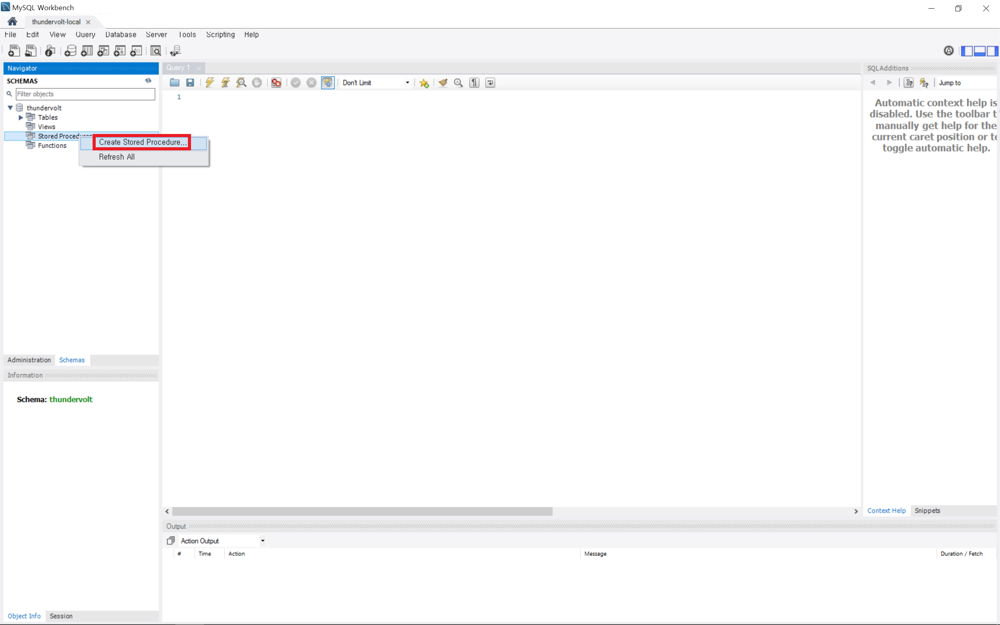
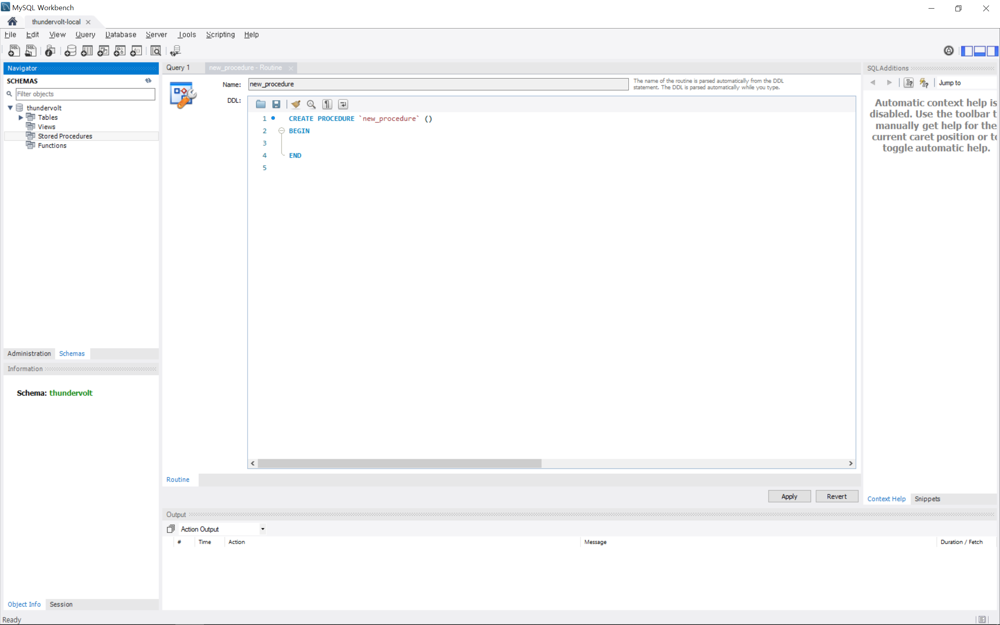
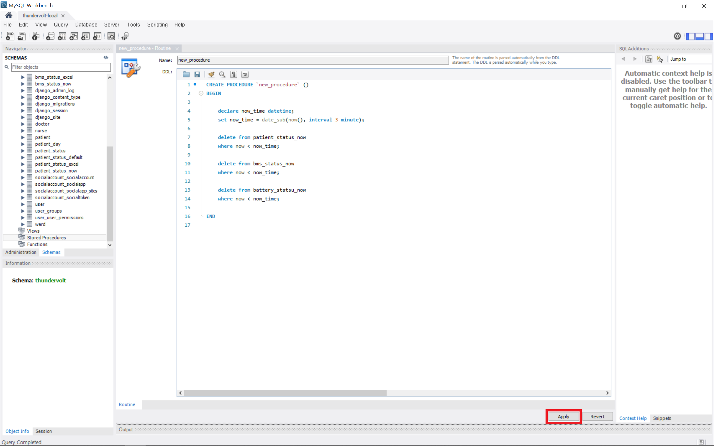
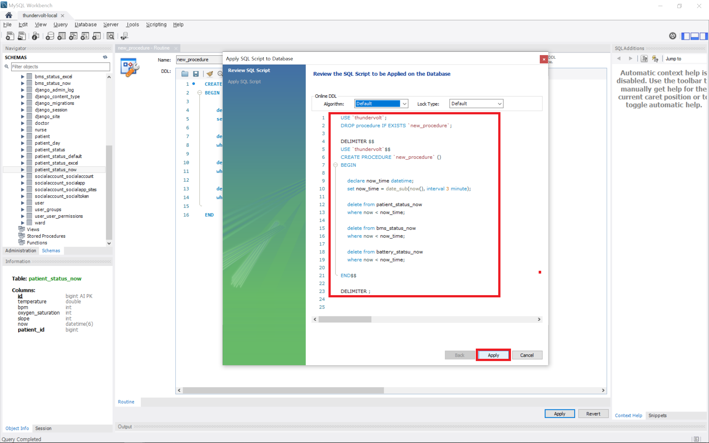
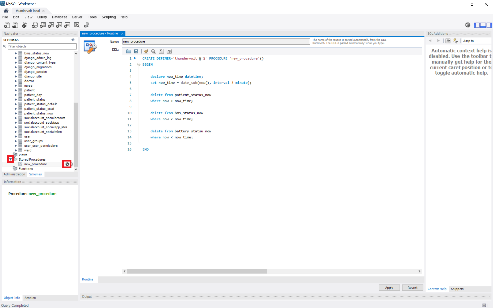
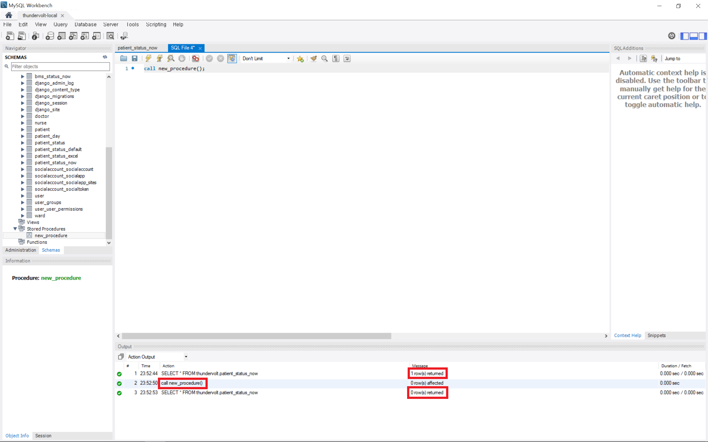

# MySQL 프로시저(procedure)

### 목차

1. [프로시저 생성](#프로시저-생성)
2. [프로시저 실행](#프로시저-실행)

### 프로시저 생성

- 프로시저를 생성할 DB 접속 (커넥션)

- `Stored Procedures` 우클릭, `Create Stored Procedure` 클릭

- `프로시저명()` 안에 파라미터 이름과 데이터타입 선언, `BEGIN~END` 사이에 수행할 쿼리 작성

- `declare 변수이름 데이터타입;` 변수 선언

  `set 변수이름 = 할당할 값;` 변수에 값 할당

  `date_sub(now(), interval 3 minute)` `now()`를 기준으로 `interval 3 minute` 3분 빼기

  `delete from patient_status_now where now < now_time;` `patient_status_now` 테이블에서 `now` 컬럼 값이 `now_time` 보다 작은 데이터 행 삭제

  쿼리 작성 후 `Apply` 클릭

- 쿼리 확인 후 `Apply` 클릭

- `Finish` 클릭

- `Stored Procedures`에서 생성된 프로시저 확인 가능

### 프로시저 실행

- `call 프로시저명(파라미터);` 쿼리를 통해 프로시저 실행 가능