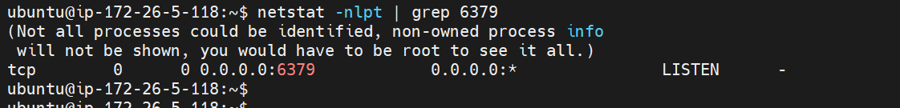
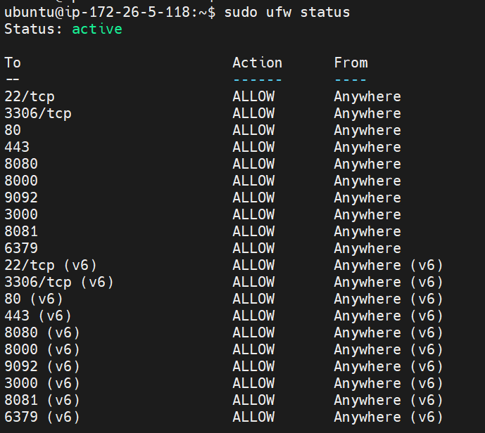

# 📌Redis

파이썬에서 redis 사용하기

참고: [django-redis 설정, redis 설치](../Django/Django Redis.md)

------------------

[toc]


### ✨Redis 설치 (파이썬)

- 리눅스 (또는 윈도우) 환경에서 redis가 설치되어 있어야 함

- 포트 오픈 확인 (리눅스)

  ```bash
  $ netstat -nlpt | grep 6379
  ```

  - 6379 포트가 열려있는지 확인(redis 기본 포트)

- 방화벽 확인 (리눅스)

  ```bash
  $ sudo ufw status
  ```

- pip 설치 명령어 (파이썬)

```bash
$ pip install redis
```


### ✨연결 및 데이터 저장, 삭제

```python
import redis

# 연결
connect = redis.StrictRedis(host='{localhost 또는 IP}', port=6379, db={사용할 DB 번호}, charset='utf-8', decode_responses=True, password={password})

# 저장
connect.set('{key}', '{value}')

# 삭제
connect.delete('{key}')

# 전체 삭제
connect.flushdb()
```

또는

```python
import redis

# 연결
with redis.StrictRedis(host='{localhost 또는 IP}', port=6379, db={사용할 DB 번호}, charset='utf-8', decode_responses=True, password={password}) as connect:
    
    # 저장
    connect.set('{key}', '{value}')
    
    # 삭제
    connect.delete('{key}')
    
    # 전체 삭제
    connect.flushdb()
```

- db, chartset, decode_responses, password 는 필수값 X
  - db는 0번이 기본값
  - charset과 decode_responses를 설정하지 않을 시 값이 바이트 형식으로 저장되어 오류 발생 가능
  - 보안을 위해 password 설정 권장